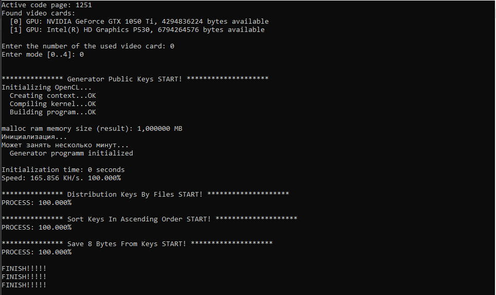

# Генерация всех возможных публичных ключей алгоритма Profanity на GPU(OpenCL), сортировка и сохранение в файлы bin. Создание баз ключей в "сжатом" виде, для использования как баз данных для программы ProfanityCrack

## Файл config.cfg

Для работы программы требуется создать три папки на диске и прописать пути к ним в файле:

* ***"folder_save_keys": "F:/tables_bin"*** - путь к папке куда будут сохраняться сгенерированные публичные ключи.

* ***"folder_sort_keys": "F:/tables_bin_sort"*** - путь к папке куда будут сохраняться таблицы отсортированных ключей.

* ***"folder_8_bytes_keys": "F:/tables_bin_8_bytes"*** - путь к папке куда будут сохраняться "сжатые" таблицы ключей.

## Описание

При запуске программа сканирует все доступные видеокарты и предложит выбрать на которой будет запускаться генерация публичных ключей.

> *Found video cards:* 

> *[0] GPU: NVIDIA GeForce GTX 1050 Ti, 4294836224 bytes available* 

> *[1] GPU: Intel(R) HD Graphics P530, 6794264576 bytes available*  

> *Enter the number of the used video card:*

Далее нужно выбрать режим.

> *Enter mode [0..4]:*

**Режим 0:** 

Последовательно запускаются режимы 1 2 3 4.

Генерируются ключи, создаются таблицы.

Так как работа программы может занимать много времени, этот режим разбит на четыре режима - 1, 2, 3 и 4. 

**Режим 1:** 

Вызывается функция GenerateAllPublicKeys(), генерируются все возможные (0x100000000) публичные ключи алгоритма Profanity. 

В начале, в std::mt19937_64 eng(init_value) (генератор случайных чисел) передается seed init_value = 0, который постоянно инкриминируется и так генерируются приватные ключи. Буферы приватных ключей отправляются на GPU, где вычисляются соответствующие публичные ключи. Эти ключи сохраняются в файлы (кол-во 256), по порядку, по 0x400000 публичных ключей в файле (1 ГБ).

Получается, номер файла и порядковый номер ключа в файле, указывают на соответствующий seed генератора случайных чисел. Файлы в формате bin сохраняются в папке "folder_save_keys", путь

к которой указан в файле config.cfg и имеют имена "00...FF.bin". 

**Режим 2:** 

Распределение ключей по файлам. Все ключи распределяются по 256 файлам, в зависимости от значения первого байта координаты Х публичного ключа. Публичные ключи, хранятся в файлах в виде X31 X30 ... X1 X0 Y31 Y30 ... Y1 Y0, что соответствует точке (x, y) на эллиптической кривой. Точка на эллиптической кривой secp256k1 соответствует публичному ключу. Когда мы берем число uint64_t (X7 X6 X5 X4 X3 X2 X1 X0) из файла, так как память у нас big-endian, мы получаем число X0X1X2X3X4X5X6X7. Вот X0 указывает на номер файла в котором мы будем хранить этот ключ. Также прибавляются 4 байта соответствующего сида генератора случайных чисел (от какого числа был получен этот ключ). Файлы создаются в папке "folder_sort_keys", путь к которой указан в файле config.cfg и имеют имена "00...FF.bin". 

**Режим 3:** 

Сортировка ключей в фалах по возрастанию. После распределения ключей режима 2, последовательно загружаются файлы, извлекаются ключи и сортируются по возрастанию первого числа uint64_t координаты Х. Получаем фалы, в которых ключи отсортированы по возрастанию чисел X0X1X2X3X4X5X6X7. Это надо, для ускорения поиска в базах, по алгоритму бинарного поиска. Отсортированные ключи и соответствующие им сиды генератора случайных чисел, сохраняются в те же файлы в папке "folder_sort_keys". 

**Режим 4:** 

Создаются файлы, соответствующие файлам режима 3 (из папки "folder_sort_keys"), только берутся с каждого ключа 8 байт X0X1X2X3X4X5X6X7. Эти файлы будут загружаться в оперативную память для поиска в программе ProfanityCrack. В ProfanityCrack можно было бы загружать из файлов folder_sort_keys, но это долго при запуске. Нужно прочитать и обработать 272 ГБ памяти, по сравнению с 32 ГБ новых файлов. Файлы создаются в папке "folder_8_bytes_keys", путь к которой указан в файле config.cfg и имеют имена "00...FF.bin".

## Файл GeneratorProfanityPubKeys.exe находится в папке exe

### ОБСУЖДЕНИЕ КОДА: https://t.me/brute_force_gpu
